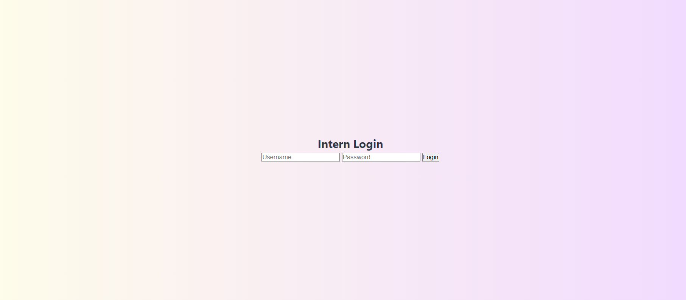
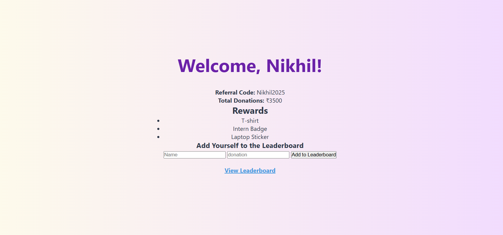
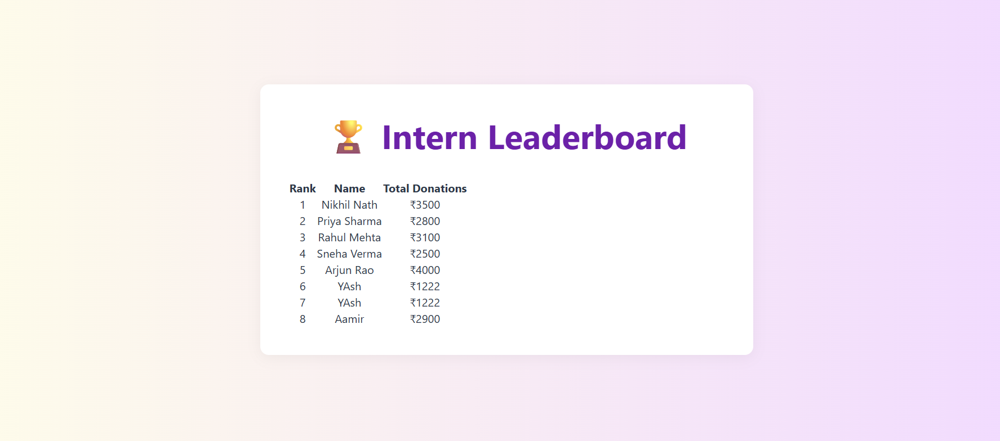

# 👩‍💻 Intern Portal

Welcome to the Intern Portal for **She Can Foundation** – a simple full-stack web application that allows interns to log in, view their dashboard (with referral code, donations raised, rewards), and check a leaderboard.

---

 ## Live Link
 
📌 [GitHub Repository](https://github.com/Nikhilnath07/intern-portal)


##  Features

- 🔐 Dummy Login Page (no real authentication)
- 📊 Dashboard with Intern Name, Referral Code & Total Donations
- 🏆 Rewards Section
- 🏅 Leaderboard (static/dynamic from PostgreSQL)
- 🎨 Beautiful UI with central alignment and pastel theme

## 📁 Folder Structure
intern-portal/
├── views/ # EJS templates
│ ├── index.ejs 
│ ├── dashboard.ejs 
│ └── leaderboard.ejs 
├── public/
│ └── styles/
│ └── main.css 
├── index.js # Main server
├── package.json
├── .gitignore
└── README.md

## 🖼 Screenshots





---

## Tech Stack

- **Node.js**
- **Express.js**
- **PostgreSQL**
- **EJS**
- **CSS/HTML**

##  How to Run Locally

### 1. Clone this Repo

```bash
git clone https://github.com/Nikhilnath07/intern-portal.git
cd intern-portal

# 2. Install Dependencies
npm install

# 3. Setup PostgreSQL
Make sure PostgreSQL is installed and running.

CREATE DATABASE intern_portal;

CREATE TABLE leaderboard (
  id SERIAL PRIMARY KEY,
  name TEXT,
  donations INTEGER
);

INSERT INTO leaderboard (name, donations) VALUES
('Nikhil', 5000),
('Priya',  3500),
('Arjun', 4000);

# PostgreSQL Config
# Edit index.js and update DB config:

const db = new pg.Client({
  user: "postgres",
  host: "localhost",
  database: "intern_portal",
  password: "your_password",
  port: 5432,
});

# Start Server
nodemon index.js

# Then open in browser:
http://localhost:3000
